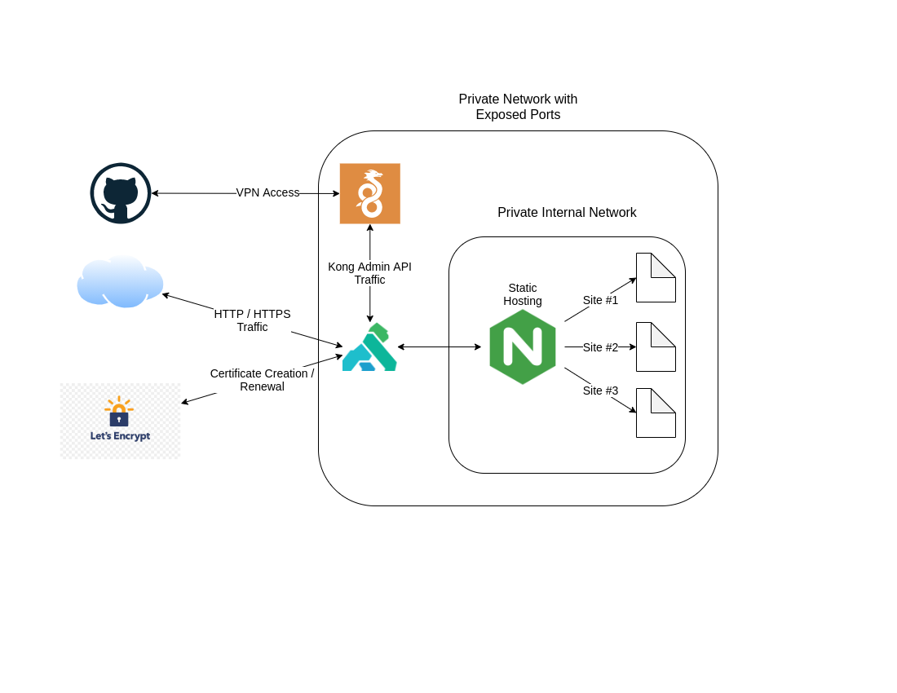

# Overview

Github action for deploying a static site via Kong and an nginx service hosting static assets

## Prequesites

* a wireguard server allowing access to an internal network
* Kong API Gateway deployed with the `ACME` and `pre-function` plugins enabled
* nginx deployed as a registered Kong service (used for deploying static assets)
* a domain name with an `A` record pointing to the Kong API Gateway instance

# Expected network architecture

## Action Parameters

All fields are required.

* `wireguard-private-key` - Private key for the wireguard interface to create (recommend storing as a Github secret)
* `wireguard-server-public-key` - The public key of the wireguard server to connect to
* `wireguard-server-endpoint` - Wireguard server endpoint, including port (e.g. `vpn.mydomain.com:51820`)
* `kong-host` - IP or DNS name for the Kong host
* `kong-port` - Kong admin API port
* `ssh-key` - Private SSH key for connecting to the remote instance (used to transfer nginx config and static assets)
* `ssh-user` - The SSH username to login to the remote instance
* `ssh-host` - IP or DNS name for SSH deploy of nginx config and static assets
* `deploy-assets` - Static assets to deploy
* `domain-name` - Domain name used to host the static assets
* `short-name` - Short name to identify this site (used for the nginx config filename and static asset directory)
* `kong-nginx-service-name` - Kong service name of the nginx instance hosting static content

# Reference
This repo is based on [simple-wireguard-deploy](https://github.com/ackersonde/simple-wireguard-deploy)
